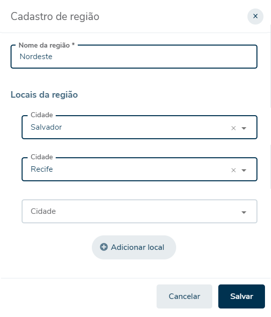

# Fretefy | FullStack

Bem vindo,

Se você chegou até aqui é porque queremos conhecer um pouco mais sobre as suas habilidades no desenvolvimento do front e back, para isso preparamos um projeto onde você terá que desenvolver um CRUD básico.

Caso você tenha alguma dúvida, pode esclarece-las no nosso canal do Discord, para entrar acesse o link https://discord.gg/Gne78BtPAu

Esperamos que você faça tudo o que o projeto especifica, mas se você não conhecer alguma tecnologia mesmo que seja o front ou back inteiro, ainda faça aquilo que você domina.

Boa sorte!

# Como começar?

1. Faça o fork do projeto `https://github.com/glauciowathier/fretefy-fullstack-test.git`
2. Faça sua implementação
3. Suba seu código no fork criado
4. Nos avise sobre a finalização da implementação 🚀

Para avisar, você pode sinalizar no Discord ou enviar um e-mail para glaucio.wathier@fretefy.com.br

# Atividade

Implementar um cadastro básico de regiões, basicamente um formulário composto por um nome e as cidade/uf que compoem aquela região.

### Campos Requeridos
- Nome
- Cidades
    - Cidade
    - UF

### Requisitos
- O campo nome é obrigatório
- Não deve permitir cadastrar duas regiões com o mesmo nome
- É obrigatório informar ao menos uma cidade na região
- Não pode ser informada a mesma cidade duas ou mais vezes
- Uma região pode ser desativada/ativada
- O campo de cidade/uf deve ser um seletor (combobox)

# 1. Atividades Front-End

O front-end deve ser desenvolvido em Angular, seguindo os conceitos do framework, na pasta front-end tem uma estrutura básica já com o módulo `regiao` pronto para você começar.

Cada operação irá listar nos requisitos técnicos alguns recursos que devem ser utilizados.

O fluxo das telas é livre, mas deve obrigatóriamente utilizar Angular Routes.

Você pode fazer um mock das operações caso não implemente o back, mas se implementar o backend, deve fazer a comunicação completa.

Não a necessidade que a interface siga um design específico, o importante é ter navegação e ser um formulário, utilizando os componentes nativos do HTML está valendo.

No front deve conter as seguintes operações:

1. Listagem de Regiões
2. Cadastro de Regiões
3. Edição de Regiões
4. Componente de Seletor de Cidade

## 1.1 Listagem de Regiões

Na listagem de regiões devem ser listadas todas as regiões cadastradas e conter ações específicas

### **Requisitos**

- As regiões devem ser listadas em forma de tabela (table)
- Cada região deve conter uma coluna que identifique se ela está ativa ou inativa
- Cada região deve conter uma ação para ativar ou desativar a região, devendo apresentar apenas a ação que modifique o estado atual. Se ela estiver ativa, deve haver uma ação desativar e vice-versa.
- Cada região deve conter uma ação para editar a região
- Na listagem deve haver em algum local uma ação que permita cadastrar uma nova região

### **Requisitos Técnicos**

- Preferencialmente deve utilizar `rxjs` com o pipe `async` na listagem de regiões
- As ações deverão preferencialmente ser realizadas via `routerLink`
- As chamadas para API devem obrigatóriamente passar por um service

## 1.2 Cadastro de Regiões

No cadastro você deve permitir que o usuário realize o cadastro de uma região, contendo os campos requeridos.

### **Requisitos**
- O campo nome é obrigatório
- Não permitir cadastrar duas regiões com o mesmo nome
- É obrigatório informar ao menos uma cidade na região
- Não pode ser informada a mesma cidade duas ou mais vezes
- O campo de cidade/uf deve ser um seletor (combobox)
- Conter uma ação para salvar
- Conter uma ação para cancelar

### **Requisitos Técnicos**

- Preferencialmente faça o formulário utilizando ReactiveForms, esperamos ver `FormGroup` para o formulário geral, `FormControl` para os campos e um `FormArray` para as cidades.
- As validações devem, preferencialmente ser feitas com os `Validators` do Angular.
- As ações deverão passar por um service, assim como na listagem.

## 1.3 Edição de Região

Na edição você deve permitir que o usuário edite um cadastro, para isso você preferencialmente deve utilizar o mesmo componente de cadastro variando apenas a rota.

## 1.4 Componente Seletor de Cidade

Implementar um componente Angular que represente o seletor de cidade

### **Requisitos**

- Listar todas as cidades no formato de `select`
- Refletir a cidade selecionada 

### **Requisitos Técnicos**

- O componente deverá ser autonomo devendo saber listar e refletir a cidade selecionada
- As ações deverão passar por um service
- Preferencialmente trabalhar com FormControl

# 2. Atividades Back-End

O back-end deve ser desenvolvido em ASP.Net Core 3.1 com uma WebApi REST e uma estruturação do projeto no formato do DDD. A persistência dos dados deve ser atraves do Entity Framework Core, no modelo Code First e utilizando Migrations.

Na pasta back-end já tem uma estrutura básica do projeto para começar, ele já está prepado para seguir os conceito de DDD, incluindo um exemplo.

Como utilizamos Entity para este projeto vamos utitilizar o SQLite para facilitar.

## Requisitos
- Implementar uma entidade região que contenha o nome e as cidades que compoem a região.
- A entidade Região deverão ser persistida em duas tabelas Regiao e RegiaoCidade em uma relação `1..N`.
- Implementar um RegiaoController que contenhas as operações de acordo com o verbo HTTP correspondente (`GET, POST, PUT`) que deverão chamar as respectivas ações do RegiaoService.
- Implementar um RegiaoService que contenha as operações do CRUD (`List, Create, Update`) que deverão chamar as respectivas ações do RegiaoRepository
- Implementar um Repository que contenham as operações de do CRUD (`List, Create, Update`) que deverão chamar as respectivas ações no Entity Framework
- Service e Repository deverão ser instanciados via Dependecy Injection no lifetime apropriado 
- Service e Repository deverão ter cada uma sua respectiva interface para uso e registro no Dependency Injection

## Observações
1. Caso não esteja habituado com o formato DDD procure referencia nos exemplos ou faça da forma que você julgar melhor (Priorizamos o formato DDD na avaliação).
2. Fique a vontade para incluir mais operações que julgar necessário, mesmo que elas não estejam nos requisitos.
3. Para simplificar abstraimos o AppService do DDD, caso queira implementar, será um diferencial.

## Dicas
1. O CORS necessita ser configurado no back para que se comunique corretamente com o front 😉
2. Acha que pode melhorar alguma coisa que está implementada, vá em frente 😎
3. Tem algum conhecimento extra que gostaria de demonstrar, a hora é agora 🏆