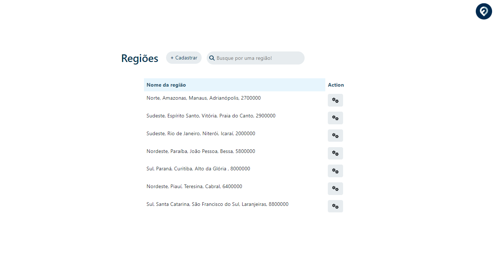
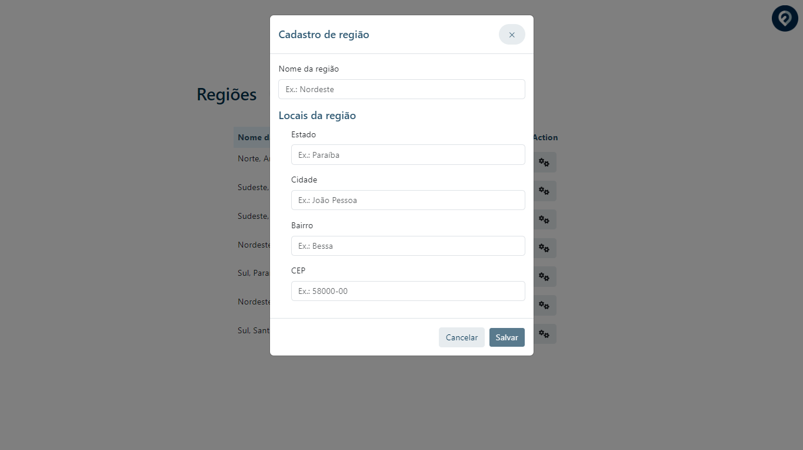
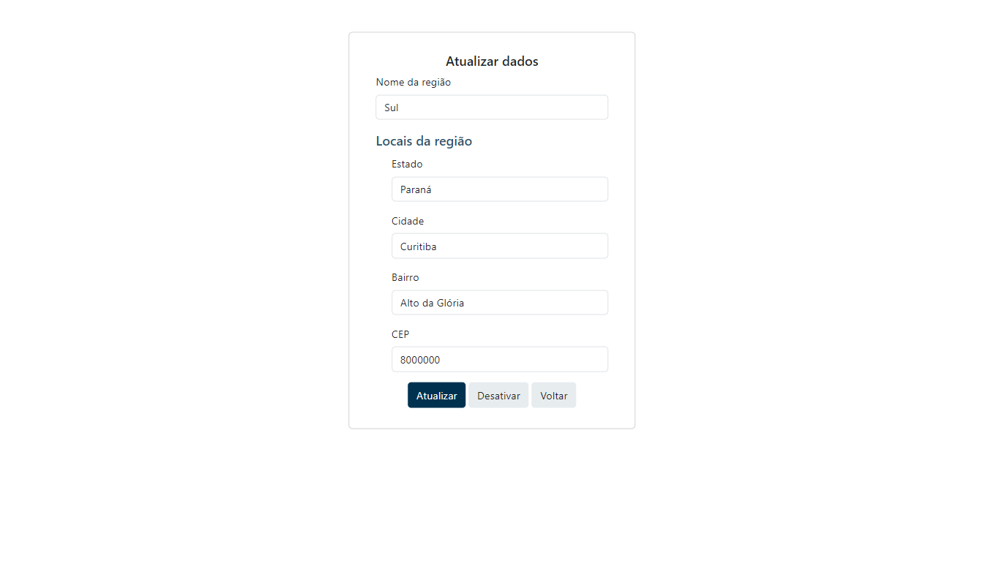

<h1 align="center">Teste Fretefy Front-end </h1>

<p align="left">🔥Uma aplicação profissional para o teste técnico da empresa Fretefy!

<br />

O projeto consiste em um sistema de gerenciamento de regiões, desenvolvido em Angular, que permite aos usuários cadastrar, editar e listar regiões de forma intuitiva. Com recursos de validação de dados e interação com o usuário, o sistema proporciona uma experiência simplificada na gestão de informações geográficas. Utilizando Angular, Typescript, JSON Server como um servidor mock e dentre outras tecnologias.

</p>

<br />

## 💻 Version 2.0

<br />

<div id="layout" align="center">
  <p align="stretch">
    <br /><br />
    <br /><br />
    
  </p>
</div>

<br />

Teste você mesmo (de forma estatica)!!🔎 https://fretefy-frontend-3c6otaz7d-maarcusvinicius.vercel.app/

<br />

## 🎡 Funcionalidades

-   Listagem de Regiões: Permite visualizar todas as regiões cadastradas, apresentando informações relevantes sobre cada uma delas.

-   Busca de Regiões: Permite pesquisar regiões cadastradas, apresentando sua região no input principal.

-   Cadastro de Regiões: Permite adicionar novas regiões ao sistema, informando os dados necessários, como nome, estado, cidade, bairro e CEP.

-   Edição de Regiões: Possibilita a edição dos dados de uma região existente, permitindo atualizar informações como nome, estado, cidade, bairro e CEP.

-   Ações de Ativação e Desativação: Permite ativar ou desativar uma região, alterando seu status no sistema.

-   JSON Server: Essa funcionalidade desempenha um papel importante na minha aplicação, permitindo simular um backend e armazenar os dados em formato JSON. Com isso, pude criar endpoints personalizados e definir os dados que seriam retornados pela API.

<br />


## 👾 Regras

-   Não a possibiidade de cadastrar uma região sem todas as informações solicitadas pelo cadastro.

-   Não a possibiidade de cadastrar uma região com o mesmo CEP de outra já cadastrada na aplicação, porém aparecera uma informação caso aconteça um engano.

-   Na inserção de CEP, apenas há possibilidade de adicionar números.

-   Para que o projeto funcione 100% deve ser iniciado, junto com o projeto, o servidor JSON.

<br />

## 🔧 Recursos utilizados

Esse projeto foi desenvolvido com as seguintes recursos e tecnologias:

-   [Angular Framework](https://angular.io/)
-   [Angular Routes](https://angular.io/guide/router)
-   [Reactive Forms](https://angular.io/guide/reactive-forms)
-   [JSON-Server](https://www.npmjs.com/package/json-server)
-   [TypeScript](https://www.typescriptlang.org/)
-   [Bootstrap](https://getbootstrap.com/)

<br />

## 🚀 Como executar o projeto

1. Clone o repositório para sua máquina local.

```bash
$ git clone https://github.com/maarcusvinicius/fretefy-frontend.git
```

2. Navegue para o diretório do projeto e instale as dependências.

```bash
$ cd fretefy-frontend
$ npm install
```

3. Inicie o servidor de desenvolvimento.

```bash
$ ng serve
```

4. Inicie o servidor JSON Server em outro terminal para o mesmo caminho.

```bash
$ json-server --watch db.json
```


5. Abra o navegador e acesse http://localhost:4200 para visualizar a aplicação.

<br />

## 💻 Estrutura do projeto

```bash
fretefy-frontend/
  angular/
  e2e/
  node_modules/
    src/
    app/
        list/
          list.component.css
          list.component.html
          list.component.spec.ts
          list.component.ts
          models.ts
        update/
          update.component.css
          update.component.html
          update.component.spec.ts
          update.component.ts
        api.service.spec.ts
        api.service.ts
        app-routing.module.ts
        app.component.css
        app.component.html
        app.component.spec.ts
        app.component.ts
        app.module.ts
      assets/
      favicon.ico
      index.html
      main.ts
      styles.css
  .editorconfig
  .gitignore
  angular.json
  db.json
  karma.config.js
  package-lock.json
  package.json
  README.md
  tsconfig.app.json
  tsconfig.json
  tsconfig.spec.json
  tslint.json
```

<br />

## 🏍️ Componentes

<br />

-   `ListComponent`: é responsável pela listagem das regiões cadastradas. Ele exibe as regiões em uma tabela, onde cada linha representa uma região. Ele mostra se uma região está ativa ou inativa e fornece ações para ativar, desativar e editar uma região. Possui um formulário de busca que permite filtrar as regiões com base em um termo digitado pelo usuário.

-   `UpdateComponent`: é responsável pela edição de uma região específica. Ele exibe um formulário preenchido com os dados da região selecionada, permitindo que o usuário faça alterações. Fornece ações para salvar as alterações feitas na região ou cancelar a edição.

-   `AppComponent`: é o componente raiz da aplicação Angular. É responsável por fornecer o template e o estilo global da aplicação. Contém o roteador principal da aplicação, definindo as rotas e os componentes correspondentes a cada rota.

<br />
<br />
<h4 align="center"> 
	🚧  Teste Fretefy Front-end 🏙️ FINALIZADO  🚧
</h4>
<br />
<br />
<br />
<br />

## Sobre a Fretefy

<p>
A Fretefy, como uma renomada LoghTech de Curitiba-PR, é reconhecida pelo seu compromisso com a inovação e excelência no setor logístico. Estou entusiasmado em pensar, fazer parte dessa equipe dinâmica e colaborativa, e estou confiante de que minha paixão pela tecnologia e minha dedicação em entregar soluções de alta qualidade contribuirão para impulsionar ainda mais o sucesso da empresa. Ao analisar a minha aplicação e considerar as habilidades demonstradas, acredito que posso contribuir significativamente para o sucesso da Fretefy. Com minha experiência em desenvolvimento front-end, utilizando tecnologias e integração com APIs, estou preparado para enfrentar os desafios da área logística e agregar valor à empresa.</p>

<br />

## Agradecimentos

<p>
Gostaría de expressar nossa sincera gratidão à equipe da empresa Fretefy pela oportunidade de participar do teste técnico para a vaga Front-End. Agradeço pela consideração em avaliar minhas habilidades e conhecimentos, e por nos proporcionar a chance de demonstrar o meu potencial. Valorizo a experiência adquirida durante esse processo e estou ansioso para contribuir com minha dedicação e habilidades para o crescimento e sucesso da empresa. Mais uma vez, obrigado pela oportunidade e estou entusiasmado com a possibilidade de fazer parte da equipe.</p>


<br />
<br />
<br />
<br />
<br />
<br />
<br />
<br />
<br />

Feito com ❤️ por Marcus Vinicius 👋🏽 Entre em contato!

//feito readme marcus


### 𝐇𝐞𝐥𝐥𝐨 𝐭𝐡𝐞𝐫𝐞, 𝐟𝐞𝐥𝐥𝐨𝐰 <𝚌𝚘𝚍𝚎𝚛𝚜/>! 

I'm a Web Developer, a programmer looking to make <br /> a difference in the digital world. [**Personal Site**](https://marcus-dev.vercel.app/) 🚀

#### My current tools

📲 Front-end Mobile with React Native  
💻 Front-end Web with Reactjs  
📡 Back-end with Nodejs  
🔣 Typescript  
🧰 And more...

#### 💬 Find me elsewhere

[](https://www.linkedin.com/in/marcus-vinicius-507718228/)
[](marcus.editor77@gmail.com)
